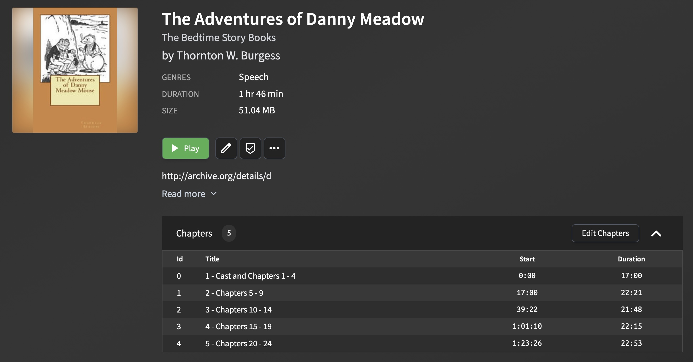

# Chapterizer


Uses whisper and will make some automatic stuff


Batch mode is faster - but - it seems to give worse results for chapterfinding


# Example

Download a free audiobook like this one:

https://librivox.org/the-adventures-of-danny-meadow-mouse-by-thornton-w-burgess/

Next run `example.py` to transcribe the book.

Once done you'll get some `chapter` files. For example you might end up wiht this:


```
00:01:05,920,  Chapter 1, Danny Meadow Mouse is worried.
00:04:48,160,  Chapter two, Danny Meadow Mouse and his short tail.
00:08:06,120,  Chapter 3, Danny Meadow Mouse plays hide and seek.
00:13:04,759,  Chapter four, old Granny Fox tries for Danny Meadow Mouse.
00:17:17,137,  Chapter 5.
00:26:13,777,  Chapter seven, old Granny Fox tries a new plan.
00:30:15,497,  Chapter 8 Brother Northwind proves a friend.
00:35:00,017,  chapter 9, Danny Meadowmouse's caught at last.
00:22:38,317,  CHAPTER X
00:27:42,357,  Chapter 11, Peter Rabbit gets a fright.
00:31:34,757,  Chapter 12, the old briar patch has a new tenet.
00:35:43,477,  Chapter 13.
00:39:40,317,  Chapter 14, Farmer Brown sets a trap.
00:22:03,702,  Chapter 15 Peter Rabbit is caught in a snare.
00:26:09,822,  Chapter 16 Peter Rabbit's hard journey.
00:27:43,702,  Part of the stake to which the snare had been fastened and which Peter had managed to
00:30:48,142,  Chapter 17 Danny meadow mouse becomes worried.
00:35:40,662,  Chapter 18, Danny meadow mouse returns a kindness.
00:39:52,822,  Chapter 19, Peter Rabbit and Danny Meadowmouse live high.
00:22:30,559,  Chapter 20.
00:27:35,559,  Chapter 21, an exciting day for Danny Meadow Mouse.
00:32:13,319,  Chapter 22
00:40:21,319,  Chapter 24
```

You'll notice some chapters are missing a full description - and some are wrong such as:
`00:27:43,702,  Part of the stake to which the snare had been fastened and which Peter had managed to`

For example to fix `Chapter 5.` open up the `.srt` file and look for where chapter 5 is:

```srt
318
00:17:17,137 --> 00:17:18,977
Chapter 5.

319
00:17:18,977 --> 00:17:22,137
What Happened on the Green Meadows
```

In this case we can assume the correct title is:

`Chapter 5. What Happened on the Green Meadows`


Also chapter 6 is missing - you can see in the srt it is here:

```srt
373
00:21:39,017 --> 00:21:48,497
End of Chapter 5 Chapter 6 Danny Meadow Mouse remembers, and ready Fox, poor kids.
```
This chapter will likely take some tweaking since you need to figure out how long the "End of Chapter 5" takes ... but you can also just guess - lets say 2 seconds. So you'd add this to the chapter file:

```
00:21:41, Chapter 6 Danny Meadow Mouse remembers
```

Once you've cleaned up the chapter files it will look like something like this. Maybe you are too lazy and don't want to fill out all the chapter titles - thats fine.


```
00:01:05,920,  Chapter 1, Danny Meadow Mouse is worried.
00:04:48,160,  Chapter 2, Danny Meadow Mouse and his short tail.
00:08:06,120,  Chapter 3, Danny Meadow Mouse plays hide and seek.
00:13:04,759,  Chapter 4, old Granny Fox tries for Danny Meadow Mouse.
00:17:17,137,  Chapter 5, What Happened on the Green Meadows
00:21:41,000,  Chapter 6 Danny Meadow Mouse remembers
00:26:13,777,  Chapter 7, old Granny Fox tries a new plan.
00:30:15,497,  Chapter 8 Brother Northwind proves a friend.
00:35:00,017,  chapter 9, Danny Meadowmouse's caught at last.
00:22:38,317,  CHAPTER X
00:27:42,357,  Chapter 11, Peter Rabbit gets a fright.
00:31:34,757,  Chapter 12, the old briar patch has a new tenet.
00:35:43,477,  Chapter 13.
00:39:40,317,  Chapter 14, Farmer Brown sets a trap.
00:22:03,702,  Chapter 15 Peter Rabbit is caught in a snare.
00:26:09,822,  Chapter 16 Peter Rabbit's hard journey.
00:30:48,142,  Chapter 17 Danny meadow mouse becomes worried.
00:35:40,662,  Chapter 18, Danny meadow mouse returns a kindness.
00:39:52,822,  Chapter 19, Peter Rabbit and Danny Meadowmouse live high.
00:22:30,559,  Chapter 20.
00:27:35,559,  Chapter 21, an exciting day for Danny Meadow Mouse.
00:32:13,319,  Chapter 22
00:40:21,319,  Chapter 24
```

The next step would be to upload this "chapter definition" to audiobook shelf

In audiobook shelf if we uploaded this data this is what it would look like:



As you can see the chapter data is bad.

If you look at Audiobookshelf's URL you'll see something like this:

`https://audiobookshelf.local/item/2b1a5c2f-02e4-47bb-99ab-cc800aeafec7`

What we care about is the UUID for the item:

`2b1a5c2f-02e4-47bb-99ab-cc800aeafec7`
